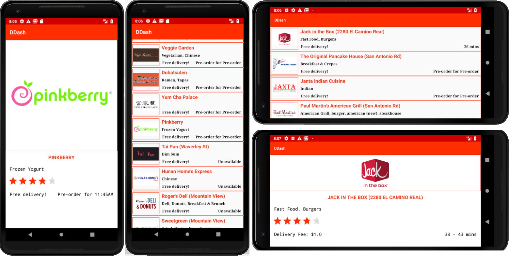

# DDash

## Contributors
 Pradeep Devarabetta Mallikarjun

## Synopsis
 A lite version of DoorDash Android application where users will be able to view a list of restaurants with basic store details .

## Work flow
  - On application launch, user will be able to view a list of restaurants.
  - On restaurant click, user will be directed to a new window where the restaurant information such as description, rating, delivery fee, and delivery time will be displayed.

## Libraries
 - [Dagger2](https://google.github.io/dagger/) - A framework to Dependency Injection.
 - [LiveData](https://developer.android.com/topic/libraries/architecture/livedata) - is a lifecycle-aware observer and is part of the Android Architecture components.
 - [Retrofit](http://square.github.io/retrofit/) - A REST client for Android.
 - [Gson](https://github.com/google/gson) - Library used for serializing/de-serializing JSON.
 - [Glide](https://github.com/bumptech/glide) - An image loading and caching library for smooth scrolling.
 - [OkHttp MockWebServer](https://github.com/square/okhttp/tree/master/mockwebserver) - Used in testing Retrofit API
 - [Mockito](https://github.com/square/okhttp/tree/master/mockwebserver) - testing framework used for writing unit tests.
  
## Screenshots
  
  
  
## License
MIT
